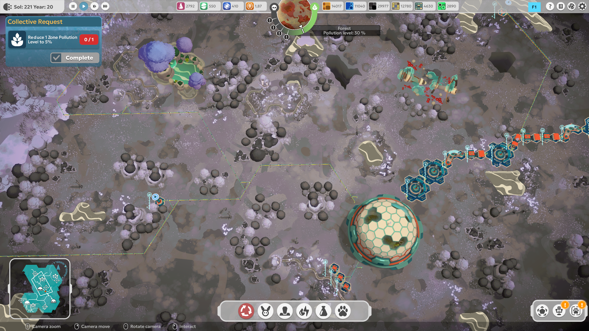
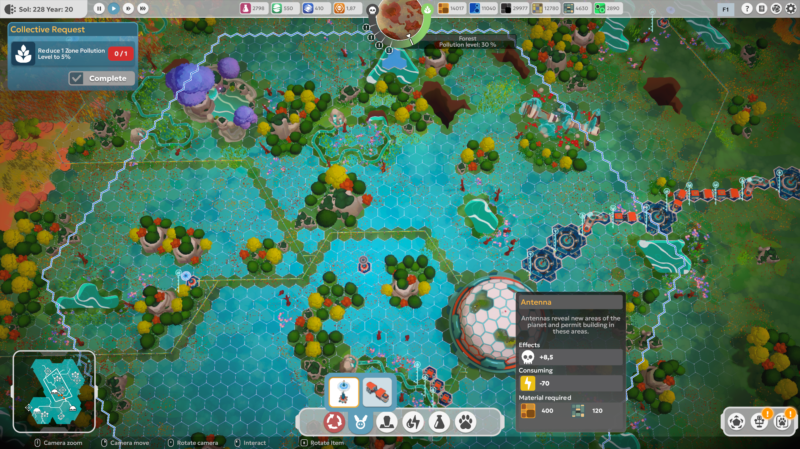
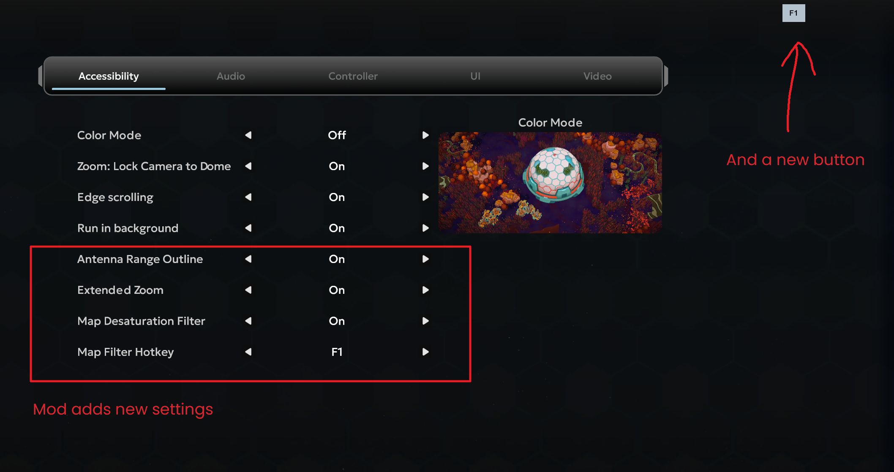

# BioEden – Visual Accessibility 1.3.0 beta 6

A Windows accessibility mod for BioEden 1.2.0.0 (Unity 6000.0.56f2).

Public repository: <https://github.com/h0n24/bioeden-visual-accessibility> · [Releases](https://github.com/h0n24/bioeden-visual-accessibility/releases)

## Settings

All options use the game's existing settings UI, including arrow navigation, **Confirm**, persistence and the discard-changes prompt.

| Section | Setting | Off | On | Default |
|---|---|---|---|---|
| Video | Depth of Field | Removes the distant blur | Keeps the game's original effect | Off |
| Accessibility | Antenna Range Outline | Original range border | White outer border with a blue center on the antenna preview and covered-area border | On |
| Accessibility | Extended Zoom | Original camera limit and pitch | About 35% more zoom with a smooth transition toward a more top-down view | On |
| Accessibility | Map Desaturation Filter | Full-color world | Desaturated world while normal building and interaction remain available | Off |
| Accessibility | Map Filter Hotkey | F1 | F1, F2 or F3 | F1 |

Press **Confirm** after changing a value. A restart is not required. Saved values remain persistent. **Default** restores the game's default values, including these settings. The filter can be toggled with its selected key or with the planet icon immediately before the Help icon in the top-right corner.

The antenna outline does not change range or building rules. It uses the same geometry as the game's original border and follows its movement and visibility. Version 1.2.1 projects the border into a screen-space layer above the fog effect: the white line is 5.5 pixels wide and the blue center is 2 pixels wide. The line is intentionally visible over obstacles and unexplored blue areas. It does not capture input and stays below normal menu overlays. Turning the setting off removes the added outline.

The map filter uses the game's existing fullscreen image adjustment with saturation set to zero. It does not open the game's planet-information mode, so building, selecting objects and following normal game markers remain available. The UI stays colored. The filter icon is created only after entering the game world, sits before Help and displays the active key. The filter is disabled after a fresh installation. When enabled, only player structures, mineral objects and polluted water are redrawn in color; grass, trees, rocks, clean water stay desaturated. Ambient cloud and ground-fog VFX are hidden until the filter is switched off. The selective redraw avoids the full-scene performance cost of earlier builds. Extended Zoom suppresses Depth of Field while active and restores the user's Video setting when disabled.

## Screenshots

The screenshots below show the filter in the game world, while placing an antenna, and the added Accessibility settings.

Extended Zoom applies to the normal world camera. It does not change the dome interior, topographic map or cinematic cameras. The original pitch is kept through the first half of the range; the second half smoothly moves toward a more top-down view. At maximum zoom the pitch range is 70–82° downward unless the original value is already higher. This reduces the unrendered horizon strip seen in earlier builds. Render distance is unchanged, and the automatic map transition remains at the end of the expanded range. Turning the setting off restores the original pitch and zoom limit.

## Installation and removal

1. Close BioEden.
2. Download the ZIP from **Releases**, extract it and run `install.ps1` or `Install.cmd`.
3. If the installer cannot find the game, pass its path with `-GamePath`.

Use `Status.cmd` to check the installation. `Uninstall.cmd` restores the original game libraries and removes the mod runtime. The mod does not require a mod loader or the .NET SDK.

You can select another game folder with `install.ps1 -GamePath "path to the game"`, or call `NoDOF.ps1 -Action Install -GamePath "path to the game"` directly.

The installer recognizes the original game and supported previous mod versions. Use the current installer when upgrading. Older packages are kept only as backups.

## Backups and compatibility

Original libraries are kept beside the game libraries in `BioEden_Data\Managed` with the `.NoDOF.original` suffix. The installer verifies SHA-256 hashes for the original files, package payload and generated patches, and refuses unknown versions. It stages all changes first and rolls back the operation if anything fails.

A game update or file verification may require a new patch version. Do not copy old backups over a newer game installation.

## Verification status

- The user confirmed the Depth of Field setting and effect in-game.
- Version 1.3.0 builds with zero warnings and zero errors.
- Installer upgrades, v1.0 legacy transitions, v1.2 beta 1 and v1.2.1 beta 2 upgrades, repeated installs, uninstall and unknown-file rejection are covered by automated tests.
- A forced failure after the first library replacement rolls back all changed files, including the runtime.
- Semantic verification confirms six intended game hooks; the other 19,572 method bodies remain unchanged.
- Zoom restoration, smooth pitch limits and screen-space segment clipping passed, including 10,000 reversed segments.
- **Selective building/material colors, clean versus polluted water, filter performance, automatic DoF suppression with Extended Zoom and the in-game icon still require manual testing.** See `MANUAL-TEST.md`.
- Cloud VFX color controls are converted to luminance while the filter is enabled and restored when it is disabled.

If the added layer or expected geometry fails, the mod keeps the original border and writes a `[BioEden.NoDOF]` entry to `Player.log`. Each border is limited to 8,000 visible screen-space segments to stay within Unity UI geometry limits.

## Source code

`src/Runtime` contains the menu integration, effect control and outline geometry. `src/Patcher` contains the game-library patcher. `tests` contains the installation and patch-scope checks. Building requires .NET SDK 10 and the local original game libraries; see `Build.ps1`. Game libraries are not included in the distribution ZIP.

The installer uses Mono.Cecil 0.11.6 (MIT); its license is included in `THIRD-PARTY-LICENSES.txt`.
